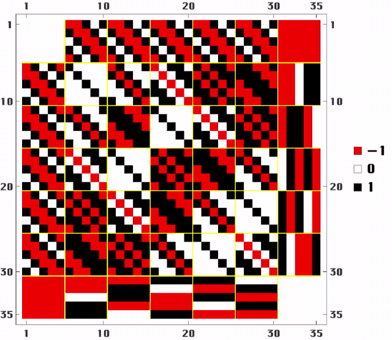

# W(35,25)



This repository contains weighing matrices which were discovered by Christopher Munro between August 12th 2026 and September 9th 2026. The construction of these matrices will be presented in a forthcoming paper. A first draft is available in `draft-w35-25-cm2026.pdf`.

Weighing matrices $W(n,k)$ are matrices of the form:

$$WW^\\top=k I$$

where $I$ is an $n\\times n$ identity matrix, $k$ is a positive integer, and $W$ has entries in $\{-1,0,+1\}$. They are special objects studied in the theory of combinatorial designs. The existence of a weighing matrix $W(35,25)$ has been listed as open in recent catalogues. This repository contains 566 confirmed H-class representatives for $n=35$, $k=25$. Their ranks over $\\mathbb{F}\_5$ cover every value from 8 through 17.

The classes 1 and 2 were the first to be found by an OR-Tools CP-SAT solve for the upper left $30\\times 30$ block matrix, imposing a symmetry satisfying $W=PWP^\\top$, fixing the border, and choosing the lower right constant block to be all 1, or all 0. The remaining classes were found through various tweaks to the original 1 and 2 by permutation of the constant border and block negations.

## Representatives

The `representatives/` folder is split by construction method:

- `published/H001.txt` through `published/H041.txt` are the 41 classes numbered in the paper. `H001.txt` uses the neater class-1 representative.
- `completions/H042.txt` through `completions/H472.txt` are 431 further classes obtained by choosing the upper and lower completion borders independently.
- `rebanded/H473.txt` through `rebanded/H566.txt` are 94 further classes found by re-banding the $25+5+5$ split.

Thus the catalogue contains

$$41+431+94=566$$

representatives. The numbering is continuous: the first 41 H-numbers agree with the paper's class numbers, the completion batch continues from H042, and the re-banded batch continues from H473.

Each matrix file starts with concise metadata recording $\\Lambda$, the construction method, $\\mathrm{rank}_5$, $\\pi(0)$, $\\pi(1)$, and whether the representative is symmetric. Re-banded files also record the relevant $30\\times30$ and $25\\times25$ block information. The file `representatives/manifest.csv` maps every exported H-number to its published class, original catalogue identifier, core, completion pair, and invariant data.

The rank distribution is:

| $\\mathrm{rank}_5$ | Number of classes |
|---:|---:|
| 8 | 1 |
| 9 | 7 |
| 10 | 28 |
| 11 | 45 |
| 12 | 38 |
| 13 | 18 |
| 14 | 36 |
| 15 | 138 |
| 16 | 180 |
| 17 | 75 |

This is a catalogue of the classes currently known from these constructions, not a classification of every possible $W(35,25)$.

## Cores

The `cores/` folder contains all nine $30\\times30$ cores as `I.txt` through `IX.txt`, together with the negated core variant `IIIn.txt` used by the completion catalogue. The files use the Roman names from the paper.

## Scripts and verification

The `scripts/` folder contains the three executable listings printed in the paper:

- `neater_lambda_j.wls` constructs the neater class-1 representative in Wolfram Language.
- `find_w35_cpsat.py` is the OR-Tools CP-SAT construction.
- `wm_equivalent.wls` performs signed-equivalence checks in Wolfram Language.

It also contains `verify_catalogue.py`, a standalone Python verifier for all 566 representatives. Install its Python dependencies from the repository root:

```text
python -m pip install -r requirements.txt
```

Then run:

```text
python scripts/verify_catalogue.py
```

The verifier checks both weighing identities, the metadata, rank over $\\mathbb{F}\_5$, and the complete row and column 4-profiles. It proves pairwise H-inequivalence by separating pairs with these exact invariants and applying an exact signed-incidence graph isomorphism test to every remaining pair. In the current catalogue the invariants separate 159,879 of the 159,895 pairs, and all remaining 16 pairs are distinct under the graph test. The Wolfram Language scripts require Mathematica or Wolfram Engine separately.
